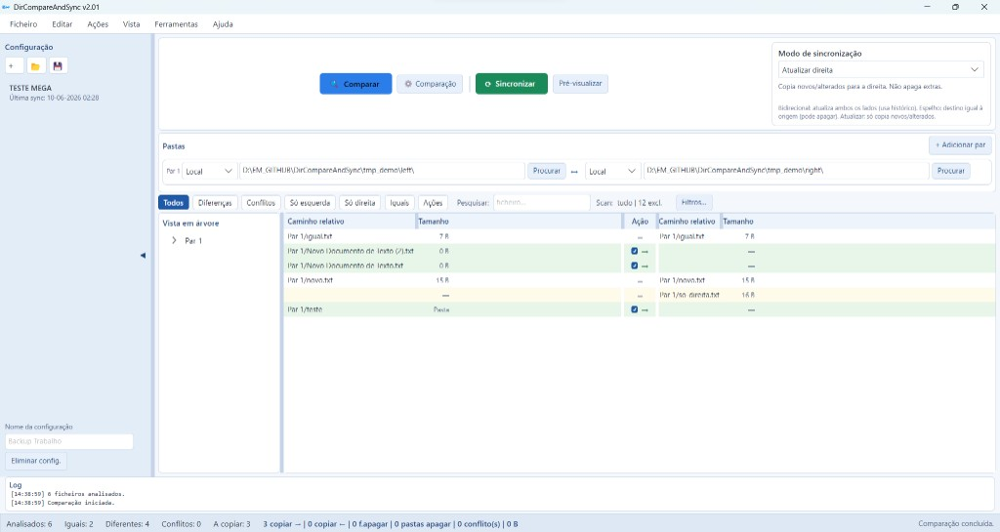
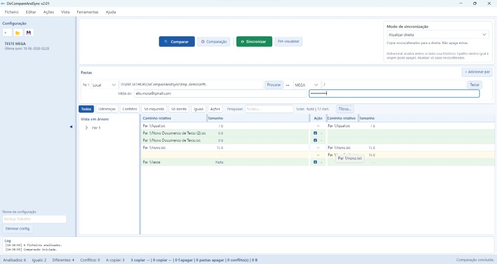
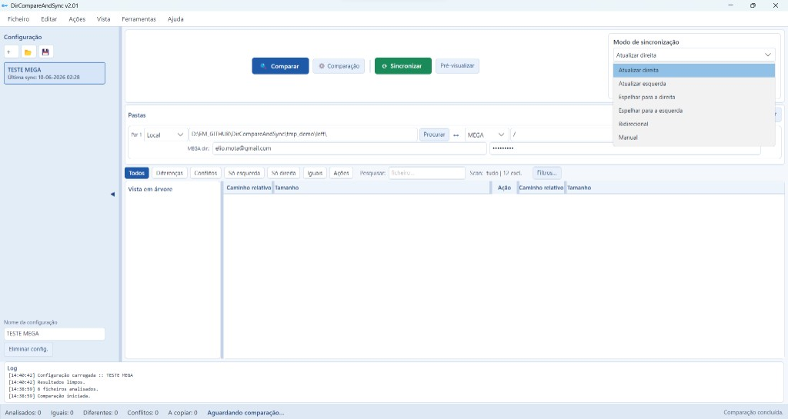
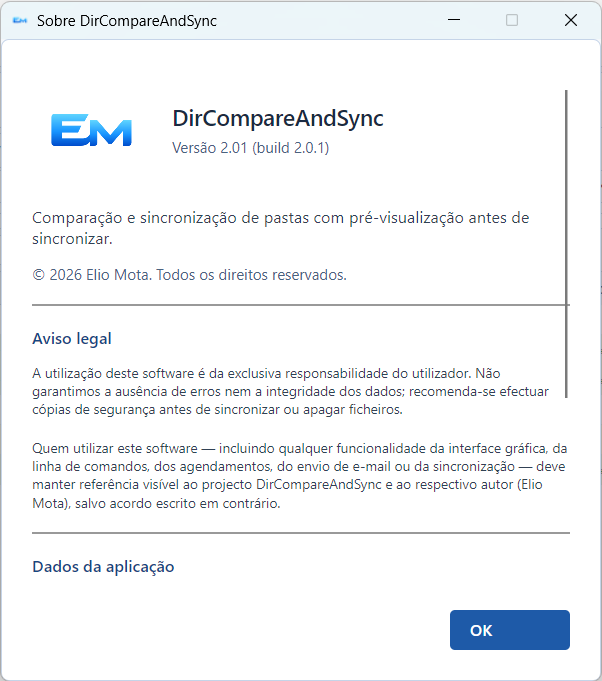

# DirCompareAndSync

**Comparar e sincronizar pastas no Windows** — com **pré-visualização** antes de copiar ou apagar ficheiros.

Ferramenta gratuita para **backup de pastas**, **sincronização de ficheiros** e **comparação de diretórios**. Suporta pastas locais, partilhas de rede (UNC), **FTP/FTPS**, **MEGA** e **Google Drive**.

Inspiração de fluxo: [FreeFileSync](https://freefilesync.org) — com confirmação obrigatória antes de sincronizar.

---

## Download

| Ficheiro | Descrição |
|----------|-----------|
| **[DirCompareAndSync-Installer.exe](https://github.com/ElioMota/DirCompareAndSync-Releases/releases/latest/download/DirCompareAndSync-Installer.exe)** | **Recomendado** — assistente com escolha de pasta, atalhos e opção de abrir ao terminar |
| [DirCompareAndSync-win-Setup.exe](https://github.com/ElioMota/DirCompareAndSync-Releases/releases/latest/download/DirCompareAndSync-win-Setup.exe) | Instalação rápida (sem assistente) |
| [DirCompareAndSync-win-Portable.zip](https://github.com/ElioMota/DirCompareAndSync-Releases/releases/latest/download/DirCompareAndSync-win-Portable.zip) | Versão portátil (sem instalador) |

**Todas as versões:** [Releases](https://github.com/ElioMota/DirCompareAndSync-Releases/releases/latest)

---

## Funcionalidades

- **Comparar pastas** lado a lado (grelha com diferenças, conflitos, ficheiros só num lado)
- **Pré-visualizar** o plano de sincronização (*dry-run*) antes de executar
- **Sincronizar** só após confirmação — copiar, actualizar e apagar com segurança
- **Modos:** actualizar esquerda/direita, espelhar, bidirecional
- **Destinos:** Local, `\\servidor\partilha`, FTP/FTPS, MEGA, Google Drive
- **Sessões** guardadas (vários pares de pastas com definições próprias)
- **Agendamentos** automáticos (com a app ou tarefa do Windows)
- **E-mail** com log em ZIP após agendamentos (SMTP configurável)
- **Actualizações** automáticas: **Ajuda → Verificar actualizações…**

---

## Capturas de ecrã

### Comparação entre pastas locais

Grelha com diferenças, filtros e pré-visualização das acções antes de sincronizar.

### Sincronização com MEGA

Compare e sincronize pastas locais com a cloud **MEGA** (também suporta FTP/FTPS e Google Drive).

### Modos de sincronização

Actualizar, espelhar, bidirecional ou manual — escolha o modo adequado a cada tarefa.

### Janela Sobre

---

## Instalação (Windows 10/11, 64 bits)

1. Descarregue **`DirCompareAndSync-Installer.exe`** (link acima).
2. Execute o assistente e escolha a **pasta de instalação**.
3. Na página *Tarefas adicionais*, seleccione se pretende:
   - atalho no **Ambiente de trabalho**
   - atalho na **barra de tarefas**
   - **abrir o programa** ao terminar a instalação
4. Abra pelo Menu Iniciar ou pelos atalhos criados.

Os seus dados (sessões, agendamentos, definições) ficam em:

`%LocalAppData%\DirCompareAndSync\.sync\`

Esta pasta **não é apagada** quando actualiza o programa.

---

## Actualizar para a versão mais recente

Se já tem o DirCompareAndSync instalado:

1. Abra a aplicação.
2. Menu **Ajuda → Verificar actualizações…**
3. Siga o assistente de actualização.

Ou instale por cima com o instalador mais recente — as sessões são preservadas.

---

## Requisitos

| Item | Mínimo |
|------|--------|
| Sistema | Windows 10 ou 11 (64 bits) |
| Espaço | ~150 MB |
| Rede | Opcional (FTP, MEGA, Google Drive, partilhas UNC) |
| Google Drive | Variáveis `DCS_GOOGLE_CLIENT_ID` e `DCS_GOOGLE_CLIENT_SECRET` (utilizador avançado) |

---

## Primeiros passos

1. Defina o **par de pastas** (esquerda e direita).
2. Clique em **Comparar** para ver diferenças.
3. Clique em **Sincronizar** — aparece a **pré-visualização** com o resumo de acções.
4. Confirme só quando estiver de acordo com o plano.

---

## Palavras-chave

*folder sync, directory compare, file synchronization, backup folders, Windows sync tool, FreeFileSync alternative, FTP sync, MEGA sync, Google Drive sync, comparar pastas, sincronizar pastas, backup de ficheiros*

---

## Licença e autor

© 2026 **Elio Mota**. Todos os direitos reservados.

Este repositório contém **instaladores e pacotes de actualização**. O código fonte é mantido separadamente.

---

## Suporte

Problemas ou sugestões: abra uma [Issue](https://github.com/ElioMota/DirCompareAndSync-Releases/issues) neste repositório.
